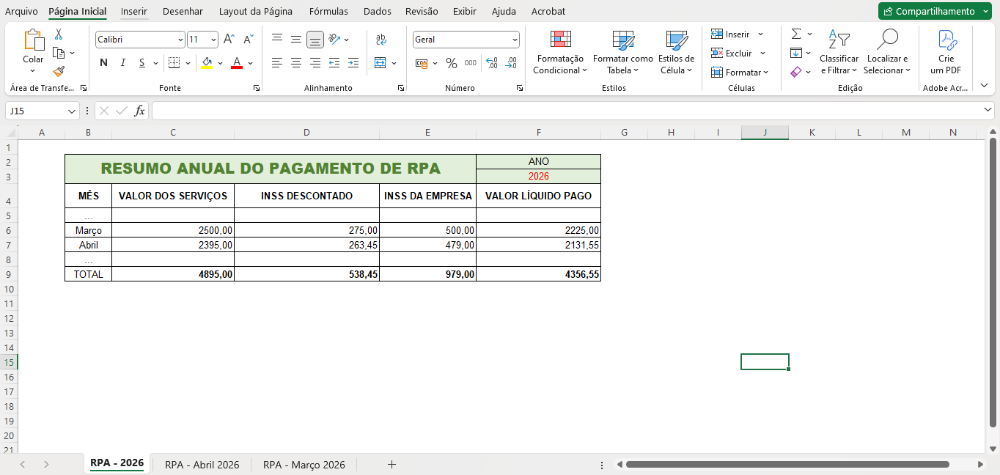
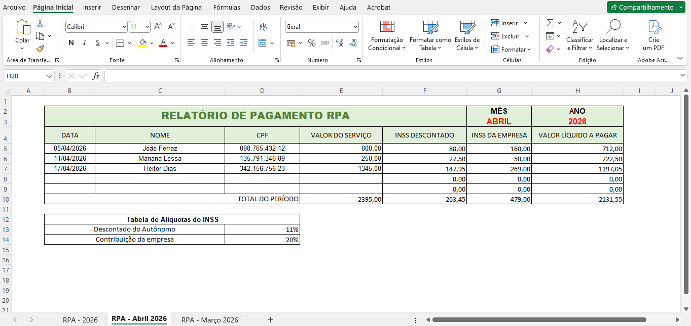
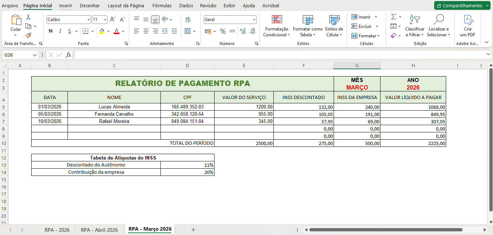

# Recibo de Pagamento Autônomo
Projeto em Excel desenvolvido no curso de Excel básico ao avançado (Udemy), simulando um recibo de pagamento para trabalhadores autônomos.

# Sobre o projeto
Este projeto consiste na criação de um modelo funcional de recibo de pagamento, com cálculos automatizados e estrutura otimizada para facilitar o preenchimento e controle financeiro.
A proposta foi aplicar, na prática, conceitos aprendidos em Excel do básico ao avançado, simulando uma situação real de uso.

# Objetivos
- Automatizar o cálculo de valores em recibos
- Criar um modelo reutilizável e de fácil preenchimento
- Aplicar boas práticas de organização e estruturação de planilhas

# Funcionalidades
- Cálculo automático de valores
- Campos estruturados para entrada de dados
- Layout organizado e profissional
- Redução de erros manuais no preenchimento

# Tecnologias e Ferramentas
- Microsoft Excel
- Fórmulas e funções (ex: SE, SOMA, etc.)
- Estruturação de planilhas

# Possíveis melhorias futuras
- Integração com Power BI para visualização de dados
- Uso de VBA para automação mais avançada
- Expansão para controle financeiro completo

# Preview

# Arquivo do projeto
- `Projeto Recibo de Pagamento Autônomo.xlsx`

# Autora
Maria Clara Furtado Nunes

## Considerações
Este projeto faz parte do meu processo de desenvolvimento na área de dados, com foco em análise, automação e criação de soluções eficientes utilizando ferramentas como Excel, Power BI e SQL.
